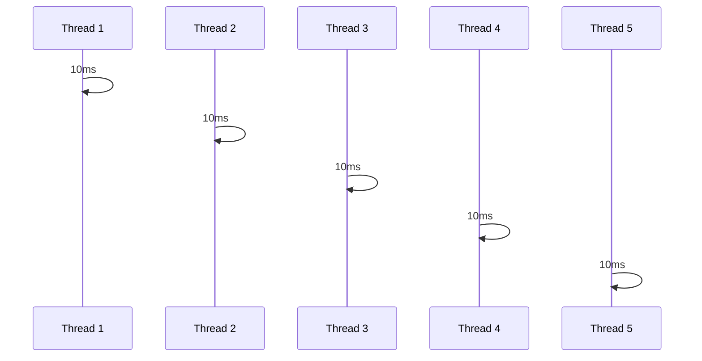
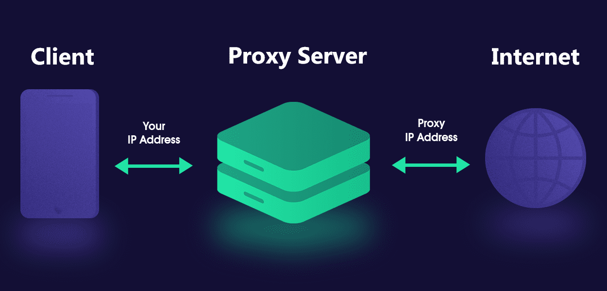

## Introdução a arquitetura de software

### Tipos de Arquitetura

* Software
* Solução
* Tecnológica
* Corporativa
  
#### O que é Arquitetura Tecnológica?

Especialidade em tecnologias específicas de mercado. Acaba gerando valor baseado em especialidades. E, existem diversos tips de arquitetos e especialistas. Por exemplo, existem arquitetos em:

* Elastic
* Java
* SQL Server
* Oracle
* SAP
* E, por aí vai...

#### O que é Arquitetura Corporativa?

É a pessoa que impacta estrategigamente a organização como um todo. Sem contar essa pessoa consegue fazer avaliação de custos e de possíveis novas tecnologias. Outro ponto importante a mencionar , a pe pode padronizar tecnologias, processos e grandes implantações (sistemas "core" e/ou migrações). E, por fim, ela pode ser responsável por definir a estratégia de tecnologia da empresa.  

### Arquiteto de Solução e Software

#### O que é Arquiteto de Soluções?

Pessoa responsável por ficar entre a área de negócios e software. Tendo que transformar requisitos de negócio em soluções de software. E um ponto importante a mencionar, essa pessoa precisa saber "desenhar", desenhar a solução arquitetorial da solução de um software para reproduzir como ele irá funcionar. Geralmente essa pessoa usa as seguintes ferramentas:
  * C4
  * UML
  * BPMN

Essa pessoa também analisa os impactos em relação a uma escolha de uma determinada tecnologia. Pode também participar do processo comercial da pré-venda e venda. Faz analise dos impactos dos custos para o negócio.

#### O que é Arquiteto de Software?

A Arquitetura de Software é uma disciplina da Engenharia de Software e está diretamente ligada ao processo de desenvolvimento de software. E isso afeterá na estrutura organizacional da empresa. 

> "Oganizações que desenvolvem sistemas de software tendem a produzir sistemas que são cópia das estruturas de comunicação dessas empresas." - Melvin Conway

O processo de arquitetar um software estabelece que o que está sendo desenvolvido faça parte de um conjunto maior.

#### Papel do Arquiteto de Software

Os papéis principais de um arquiteto de software são:

* Definir a arquitetura de software
* Transformar requisitos de negócio em padrões arquiteturais
* Orquestrar pessoas desenvolvedoras e experts de domínio
* Entender de forma profunda conceitos e modelos arquiteturais
* Auxiliar na tomada de decisão em momentos críticos
* Reforçar boas práticas de desenvolvimento de software
* Code Reviews

> Apesar de nem todas as organizações possuírem o cargo de Arquiteto de Software normalmente profissionais com mais experiência acabam assumindo esse papel, em posições tais como: Tech Leads, Líderes Técnicos, Desenvolvedores Sênior.

### Por que aprender sobre Arquitetura de Software?

Justo para poder navegar da visão macro para a visão micro de um ou mais softwares. E, sem contar para enteder quais são as diversas opções que temos para desenvolver a mesma coisa e escolher a melhor solução para determinado contexto. Além disso, pensar a longo prazo no projeto e sua sustentabilidade.

Outro ponto a ser mencionado é tomada de decisões de forma mais fria e calculada evitando assim ser influenciado por "hypes" de mercado e mergulho em padrões de projeto e desenvolvimento e suas boas práticas.

Ter mais clareza do impacto que o software possui na organização como um todo. Todo ser humano quer gerar valor e resultado, seja interno ou externo. E isso ajuda a evoluir a sua equipe e time. Outro ponto muito importante é a tomada de decisões com mais confiança. Quando você entende mais de Arquitetura, você se sente mais confiante para tomar decisões. E, por fim, você consegue se comunicar melhor com os demais envolvidos no projeto.

### Arquitetura vs Design de Software

* Arquitetura: escopo global ou alto nível
* Design: escopo local ou baixo nível

> "Atividades relaecionadas a arquitetura de software saão sempre de design. Entretanto nem todas as atividades de design são sobre arquitetura. O objetivo primário da arquitetura de software é garantir que os atributos de qualidade, restrições de alto nível e os objetivos do negócio, sejam atendidos pelo sistema. Qualquer decisão de design que não tenha relação com este objetivo não é arquitetural. Todas as decisões de design para um componente que não sejam visíveis fora dele, geralmente, também não são. ~ Elemar Júnior."

### Sustentabilidade no dia Zero

Desenvolver software é caro. E isso pode impactar diretamente no negócio. Geralmente um determinado software resolverá uma "dor" de um cliente. Por isso que o software precisa se pagar ao longo do tempo. Procurar acompanhar a evolução do negócio. 

Assim sendo, qunato mais tempo o software fica no ar, mais retorno gera. Ou seja, a solução precisa ser arquitetada.

### Pilares da Arquitetura de Software

* **Estruturação**: ser de fácil evolução, componentização para atender os objetivos de negócio.
* **Componetização**: separar as responsabilidades de cada componente.
* **Relacionamento entre sistemas**: como os sistemas se comunicam entre si.
* **Governança**: como o software será mantido e evoluído ao longo do tempo. Ex.: Documentação, testes, etc.

### Requisitos Arquiteturais (RAs)

* **Performance**: tempo de resposta, throughput, latência, etc.
* **Armazenamento de Dados**: volume de dados, tipos de dados, onde armazenar, etc.
* **Escabilidade**: horizontal, vertical, load balance, etc.
* **Segurança**: autenticação, autorização, criptografia, etc.
* **Legal**: LGPD, GDPR, etc.
* **Audit**: logs, auditoria, etc.
* **Marketing**: SEO, campanhas, tracking, etc.

## Características Arquiteturais

As características Arquiteturais são divididas em 3 grupos:

* **Operacionais**
* **Estruturais**
* **Cross-Cutting**

### Características Operacionais

* **Disponibilidade**: tempo que o sistema está disponível para uso. Garantir o SLA dessa aplicação.
* **Recuperação de Desastres:** como o sistema se recupera de um desastre. Ex.: backup, replicação, etc.
* **Performance**: tempo de resposta, throughput, latência, etc.
* **Recuperação (backup):** crie regras de backup para o seu sistema.
* **Confiabilidade e Segurança:** como o sistema se comporta em relação a segurança. Ex.: autenticação, autorização, criptografia, etc.
* **Robustes**: verificar e ver se o sistema que você está criando ele é robusto o suficiente para atender a demanda. Ou se é escalável.
* **Escabilidade**: Como você pode verificar que o seu sistema ficará disponível para atender a demanda. Ex.: horizontal, vertical, load balance, etc.
  
### Características Estruturais

* **Configurável**: o sistema precisa ser configurável para atender a demanda. A melhor forma de saber se a sua aplicação é configurável é colocando a sua aplicação em stage.
* **Extensibilidade**: o sistema precisa ser extensível para atender a demanda. Ex.: plugins, etc.
* **Fácil Instalação**: o sistema precisa ser fácil de instalar para atender a demanda. Ex.: docker, etc.
* **Reuso de Componentes**: o sistema precisa ser reutilizável para atender a demanda. Ex.: componentização, etc.
* **Internacionalização**: o sistema precisa ser internacionalizável para atender a demanda. Ex.: i18n, etc.
* **Fácil manuntenção**: o sistema precisa ser fácil para que outras pessoas possam dar manutenção. Quanto mais simples for o seu software mais fácil será para dar manutenção. Pense bastante com relação a isso. Evitando assim o que chamamos de "over engineering" e "over architecting". Ex.: documentação, testes etc.
* **Portabilidade (diversos banco de dados)**: o sistema deve ser fácil para adoção de outros bancos de dados. Ex.: ORM, etc.
* Fácil suporte (logs, debugging): o sistema deve ser fácil para dar suporte. Foque muito em observabilidade. Ex.: logs, etc.

### Características Cross-Cutting

* **Acessibilidade**: o sistema deve seguir padrões e seguir as regras de acessibilidade. Ex.: WCAG, etc.
* **Processo de retenção e recuperação de dados (quanto tempo os dados serão mantidos)**: o sistema deve seguir as regras de retenção e recuperação de dados. Até porque isso envolve custos. Analisar o tipo de Storage que será utilizado. Ex. hot, cold, etc.
* **Autenticação e Autorização**: o sistema deve seguir as regras de autenticação e autorização. Analisar e ver como os outros serviços comunicará com um sistema distribuído nesse aspecto. Ex.: OAuth, etc.
* **Legal**: o sistema deve seguir as regras legais e conformidades do país. Ex.: LGPD, GDPR, etc.
* **Privacidade**: o sistema deve seguir as regras de privacidade. Ex.: LGPD, GDPR, etc.
* **Segurança**: o sistema deve seguir as regras de segurança e deve estar integrada de ponta a ponta. Ex.: LGPD, GDPR, etc.
* **Usabilidade**: o sistema deve seguir as regras de usabilidade. Ex.: UX, etc.

## Performance

### Perspectivas para arquitetar um software

* **Performance**: tempo de resposta, throughput, latência, etc.
* **Escabilidade**: horizontal, vertical, load balance, etc.
* **Resiliência**: tolerância a falhas, recuperação de desastres, etc.

### Métricas para medir a performance

O que é performance? É o desempenho que um software possui para completar um determinado workload.

Vejamos alguns pontos importantes:

1. As unidades de medida para avaliarmos a performance de um software são:
  * latência ou tempo de resposta
  * Throughput

2. Ter um software perfomático é diferente de ter um software escalável.

3. A primeira coisa para melhorar a performance do meu software é:

3.1 Diminuindo a latência. Mas, como?
  * Normalmente medida por milisegundos.
  * A latência é afetada pelo tempo de processamento, tempo de rede, e chamadas externas.

3.2 Aumentar throughput. Mas, como?
  * Quantidade de requisições simultaneas.
  * Diretamente ligado a latência.

### Checklist para aumento de performance

* Processamento ineficiente
* Recursos computacionais limitados
* Trabalhar de forma bloqueante
* Acesso serial a recursos

Principais formas para aumentar eficiência são:

* Escala de capacidade computacional (CPU, memória, etc)
* Lógica por trás do software (algoritmos, queries, overhead de frameworks)
* Concorrência e paralelismo (threads, processos, etc)
* Banco de dados (índices, queries, tipos de dados, schema, etc)
* Caching
  
### Escala Computacional: Escala Vertical vs Escala Horizontal

* **Escala Vertical**: aumentar a capacidade de processamento de um único servidor. Ex.: aumentar a memória RAM, aumentar o número de CPUs, etc.

* **Escala Horizontal**: aumentar a capacidade de processamento de vários servidores. Ex.: aumentar o número de servidores, etc.

### Diferença entre Concorrência e Paralelismo

> "Concorrência é sobre lidar com muitas coisas ao mesmo tempo. Paralelismo é sobre fazer muitas coisas ao mesmo tempo." - Rob Pike

### Caching

Tipos de Caching:

* Cache na borda/ Edge Computing
* Dados estáticos
* Páginas Web
* Funções internas
  * Evita reprocessamento de algoritmos pesados
* Objetos

#### Caching Exclusivo vs Compartilhado

* **Exclusivo**: cada servidor possui o seu próprio cache.
  * Baixa latência
  * Duplicado entre os nós
  * Problemas relacionados a sessões

* **Compartilhado**: todos os servidores compartilham o mesmo cache.
  * Maior latência
  * Não há duplicação
  * Sessões compartilhadas
  * Banco de dados externo
    * MySQL
    * Redis
    * Memcached

### Caching vs Edge Computing

O que é Edge Computing? É um modelo de computação distribuída que traz a computação e o armazenamento de dados mais próximo do local onde é necessário para melhorar a latência e a eficiência do tráfego de dados.

Quando falamos de Edge Computing, estamos em:

* Cache realizado mais próximo ao usuário
* Evita a requisição chegar até o Cloud Provider/Infra
* Normalmente arquivos estáticos
* CDN (Content Delivery Network)
* Cloudflare workers
* Vercel 

## Escabilidade

> "Escabilidade é a capacidade de sistemas suportarem o aumento (ou a redução) dos workloads incrementando (ou reduzindo) o custo em menor ou igual proporção." - Elemar Jr.

### Escabilidade vs Performance

Enquanto performance tem o foco em reduzir a latência e aumentar o throughput, a escabilidade visa termos a possibilidade de aumentar ou diminuir o throughput adicionando ou removendo a capacidade computacional.

### Escalando aplicações

* **Disco efêmero**: disco que não é persistido. Ex.: disco de máquina virtual, etc.
* **Servidor de aplicação vs Servidor de assets**: separar os servidores de aplicação dos servidores de assets. Ex.: imagens, vídeos, etc.
* **Cache centralizado**: o cache não ficará na sua máquina. Nesse caso ele será compartilhado. 
* **Sessões centralizadas**: toda aplicação deve ser stateless. E, nesse caso as sessões precisam ser compartilhadas também.
* **Upload/Gravação de Arquivos**: o upload e a gravação de arquivos devem ser feitos em um storage externo. Ex.: S3, etc.
  
Resumindo, escalar aplicações significa descentralizar os recursos. Tudo pode ser criado e destruído a qualquer momento.

### Escalando banco de dados

* **Aumentar recursos computacionais**: aumentar a capacidade computacional do banco de dados. Ex.: aumentar a memória RAM, aumentar o número de CPUs, etc.
* **Distribuindo responsabilidades (escrita vs leitura)**: separar os bancos de dados de leitura dos bancos de dados de escrita.
* **Shards de forma horizontal**: adicionar várias máquinas de leitura ou dividir partições de dados em várias máquinas. 

> O que é Sharding? Sharding é uma técnica de escalabilidade horizontal usada em bancos de dados distribuídos. Ele envolve a divisão de um banco de dados em várias partições menores, chamadas shards, que são distribuídas em várias máquinas. Cada shard contém um subconjunto dos dados do banco de dados completo.
> Ao dividir o banco de dados em shards, é possível distribuir a carga de leitura e gravação em várias máquinas, permitindo que o banco de dados suporte um grande número de usuários e transações. Além disso, o sharding pode melhorar a disponibilidade do banco de dados, já que a falha de uma máquina não afetará todo o banco de dados. 

* **Serverless**: utilizar um banco de dados serverless. Ex.: DynamoDB, etc.

### Otimização de queries e índices: 

* Trabalhe com índices de forma consciente
* APM (Application Performance monitoring) nas queries
* Explain nas queries
* CQRS (Command Query Responsibility Segregation)

### Proxy Reverso

> O que é Proxy Reverso? Um proxy reverso é um servidor que atua como intermediário entre os clientes e os servidores de destino. Ele recebe solicitações dos clientes e as encaminha para os servidores de destino, ocultando a identidade dos servidores de destino dos clientes. O proxy reverso também pode ser usado para balanceamento de carga, cache de conteúdo e segurança de rede.

#### Soluções populares de Proxy Reverso

* Nginx
* HAProxy (HA = High Availability)
* Traefik

## Resiliência

Resiliência é um conjunto de estratégias adotadas intencionalmente para a *adaptação* de um sistema quando uma falha ocorre.

Ter estratégias de resiliência nos possibilita minimizar os riscos de perda de dados e transações importantes para o negócio.

### Proteger e ser protegido

* Um sistema em uma arquitetura distribuída precisa adotar mecanismos de autopreservação para garantir ao máximo sua operação com *qualidade*.

* Um sistema precisa não pode ser 'egoísta' ao ponto de realizar mais requisições em um sistema que está falhando.

* Um sistema lento no ar muitas vezes é pior do que um sistema dora do ar (Efeito dominó).

### Health check

* Sem sinais vitais, não é possível saber a "saúde" de um sistema. 

* Um sistema que não está saudável possui uma chance de se recuperar caso o tráfego pare de ser direcionado a ele temporariamente.

* Health check de qualidade

### Rate Limit

* Protege o sistema baseado no que ele foi projetado para suportar.

* Preferência programada por tipo de client

### Circuit Breaker

Protege o sistema fazendo com que as requisições feitas para ele sejam negadas. Ex: erro 500.

Agora vejamos os tipos de circuit breaker:

* **Circuito aberto**: requisições não chegam ao sistema. Erro instantâneo ao client.
* **Circuito fechado**: requisições chegam normalmente
* **Meio aberto**: permite uma quantidade limitada de requisições para verificação se o sistema tem condições de voltar ao ar integralmente.

### API Gateway

* Garante que requisições "inapropriadas" chegeuem até o sistema. Ex.: usuário não autenticado.

* Implementa políticas de Rate Limiting, Health Check.

### Service Mesh

> Service Mesh é uma camada de infraestrutura de rede que gerencia o tráfego entre microservices em um ambiente de nuvem. Ele fornece recursos como descoberta de serviço, balanceamento de carga, segurança, monitoramento e resiliência. O Service Mesh é implementado como um conjunto de proxies de rede que são injetados em cada instância de microservice e que se comunicam uns com os outros para fornecer esses recursos.

* Controla o tráfego de rede.
* Evita implementações de proteção pelo próprio sistema.
* mTLS (Mutual TLS) - Autenticação mútua entre os serviços.
* Com Service Mesh a gente consegue trabalhar de forma automatizada com: Circuit Breaker, retry, timeout, fault inmjection, etc.

### Comunicação assíncrona

* Evita perda de dados.
* Não há perda de dados no envio de uma transação de o server estiver fora.
* Servidor pode processar a transação em seu tempo quando estiver disponível/online
* Entender com profundidade o message broker/sistema de stream

### Garantias de entrega com Retry

> Exponential backoff é uma técnica usada para lidar com falhas temporárias em sistemas distribuídos. Quando uma solicitação falha, em vez de tentar novamente imediatamente, a técnica de exponential backoff espera um período de tempo crescente antes de tentar novamente. O tempo de espera aumenta exponencialmente a cada tentativa subsequente, o que ajuda a evitar sobrecarregar o sistema com solicitações repetidas. Isso pode ajudar a melhorar a resiliência do sistema e garantir que as solicitações sejam processadas com sucesso em momentos de alta carga ou instabilidade.

> Exponential backoff com Jitter é uma variação da técnica de exponential backoff que adiciona um elemento aleatório ao tempo de espera antes de cada nova tentativa. Isso ajuda a evitar que várias solicitações falhadas sejam reenviadas simultaneamente, o que pode sobrecarregar o sistema. O Jitter é adicionado ao tempo de espera multiplicando-o por um valor aleatório entre 0 e 1. Por exemplo, se o tempo de espera for de 10 segundos e o Jitter for de 0,5, o tempo de espera real antes da próxima tentativa será entre 5 e 15 segundos. Essa técnica pode ajudar a melhorar a resiliência do sistema e garantir que as solicitações sejam processadas com sucesso em momentos de alta carga ou instabilidade.

### Garantias de entrega com Kafka

* Kafka é um sistema de mensagens distribuído que fornece uma maneira confiável de enviar mensagens entre aplicativos. Ele é projetado para lidar com grandes volumes de dados e pode ser usado para substituir sistemas de mensagens tradicionais, como JMS, RabbitMQ e AMQP. O Kafka é usado para uma variedade de casos de uso, incluindo streaming de dados, processamento de eventos, mensagens assíncronas, integração de aplicativos e muito mais.

### Situações complexas e decisões de alto nível

Alguns questionamentos que devem ser feitos:

* O que acontece se o message broker cair?
* Haverá perda de mensagens?
* Seu sistema ficará fora do ar?
* Como garantir resiliência?

