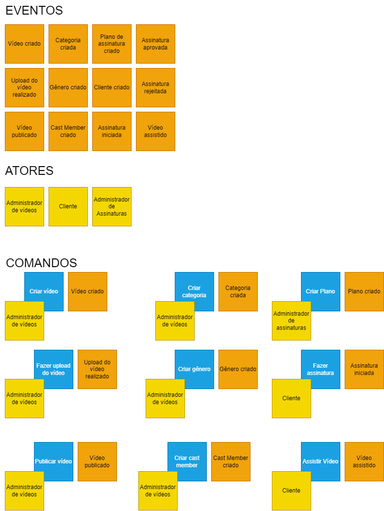
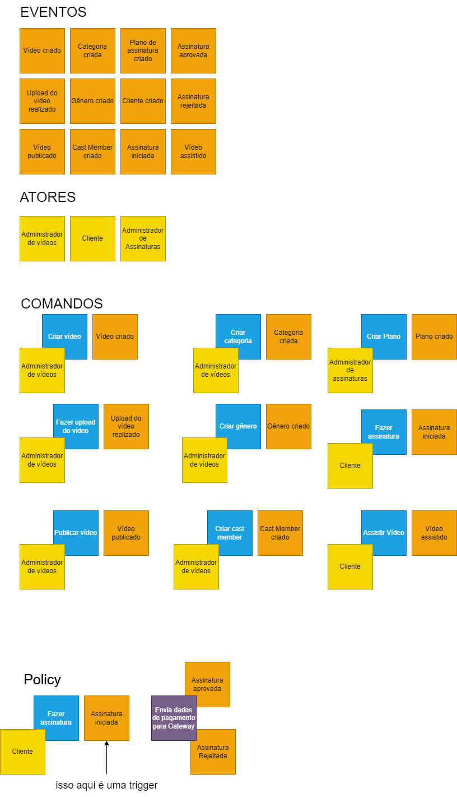
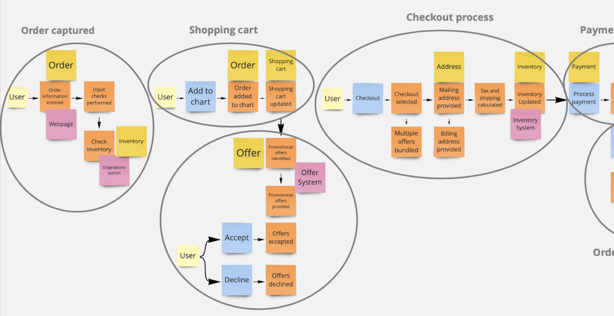
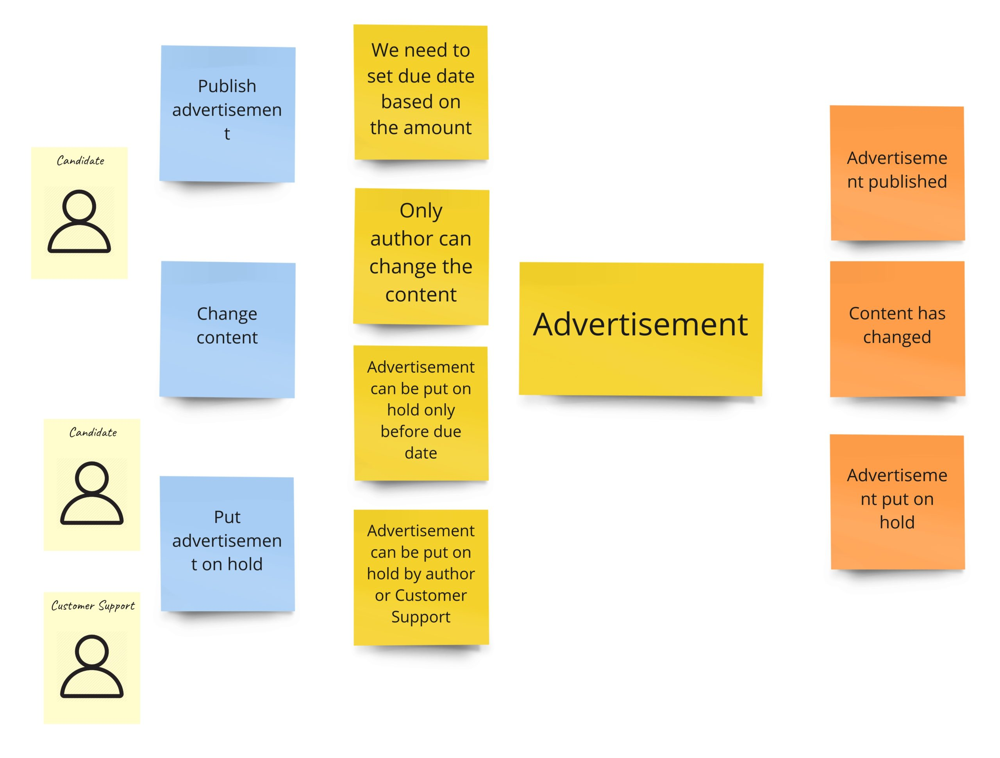

# Event Storming

## Fundamentos

### O que é Event Storming?

É uma técnica criada por Alberto Brandolini para que possamos entender de forma mais clara o domínio das aplicações através dos eventos gerados por elas.

Normalmente acontece em um formato de workshop. É uma dinâmica de grupo envolvendo "domain experts" e a área técnica.

> recomendação de livro sobre o assunto: https://leanpub.com/introducing_eventstorming

> excelente artigo sobre Event Storming: https://medium.com/@samar.benamar/event-storming-the-storm-that-cleans-up-the-mess-b2bb578db7c

## Eventos e comandos

É muito importante saber mapear os eventos e comandos que acontecem no domínio da aplicação. Isso é um domínio de evento!
São eventos relevantes ao sistema! Os verbos sempre estão no passado, pois já aconteceram.

### Eventos

- Algo que aconteceu no passado

### Comandos

- Algo que vai acontecer no futuro

## Entendendo eventos e comandos na prática

## Pontos de decisão e policies

Policy: "Quando algo acontece, faça!"

## Exemplo de Policy no projeto

## Cronologia

A cronologia é muito importante para entendermos a ordem dos eventos e comandos.

## Origem dos eventos

- Eventos externos
- Eventos internos
- Tempo
- Usuário
- Consequencia

## Definindo Contextos Delimitados

## Mapeamento de eventos Codeflix

