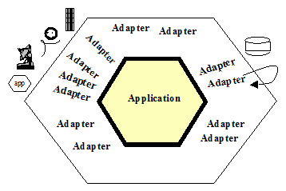
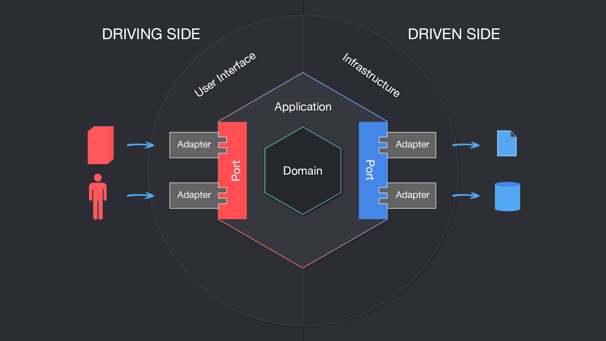

# Introdução a Arquitetura Hexagonal

## Ciclo de um projeto

### Pontos importantes sobre arquitetura

* Crescimento sustentável
* Software precisa se pagar ao passar do tempo
* Software deve ser desenhado por você e não pelo seu framework
* Peças precisam se encaixar e eventualmente substituídas

### Lembre-se!

Arquitetura diz respeito com o futuro do seu software. CRUD qualquer um faz!

### Ciclo de vida de muitos projetos

As fases refletem os problemas que muitos projetos enfrentam:

* Fase 1: 
  - Banco de Dados
  - Cadastros
  - Validações
  - Servidor Web
  - Controllers
  - Views
  - Autenticação
  - Upload de arquivos

* Fase 2: 
  - Regras de negócio
  - Criação de APIs
  - Consumo de APIs
  - Autorização
  - Relatórios
  - Logs

* Fase 3:
  - Mais acessos
  - Upgrades hardware
  - Cache
  - API parceiros
  - Regras parceiros
  - Relatórios

* Fase 4:
  - Mais acessos
  - Upgrade hardware
  - BD relatórios
  - Comandos
  - V2 da API

* Fase 5:
  - Escala horizontal
  - Sessões
  - Uploads
  - Refatoração
  - Autoscaling
  - CI/CD

* Fase 6:
  - GraphQL
  - Bugs constantes
  - Logs? Ops
  - Integração CRM
  - Migração para React
 
* Fase 7:
  - Inconsistências CRM
  - Containers
  - CI/CD
  - Memória
  - Logs
  - Se livrar do legado

* Fase 8:
  - Microserviços
  - DB compartilhado
  - Problemas com tracing
  - Lentidão
  - Custo elevado

* Fase 9:
  - Kubernetes
  - CI/CD
  - Mensageria
  - Perda de mensagens
  - Consultorias

* Fase 10:
  - Use a imaginação!

Essa é uma evolução natural de como as coisas vão acontecer com o passar do tempo e vão ficando mais complexas e difíceis de manter.

Quando você não pensa numa arquitetura sustentável, você vai ter que lidar com esses problemas e vai ter que refatorar o seu código para que ele se adeque a essas novas necessidades e fica complicado para manter e evoluir o seu software.

## Reflexões importantes

### Principais problemas

Faltou nos processos acima:

* Visão de futuro
* Limites bem definidos
* Troca e adição de componentes
* Escala
* Otimizações frequentes
* Preparado para mudanças

### Reflexões

* Está sendo doloroso para o developer?
* Poderia ter sido evitado?
* Software está se pagando?
* Será que a relação com o cliente está boa?
* Cliente terá prejuízo com a brusca mudança arquitetural?
* Em qual momento tudo se perdeu?
* Se você fosse novo na equipe, você julgaria os devs que fizeram tudo isso?

## Arquitetura vs Design de Software

"Atividades relacionadas a arquitetura de software são sempre de design. Entretanto nem todas as atividades de design são sobre arquitetura. O objetivo primário da arquitetura de software é garantir que os atributos de qualidade, restrições de alto nível e os objetivos do negócio, sejam atendidos pelo sistema. Qualquer decisão de design que não tenha relação com este objetivo não é arquitetural. Todas a decisões de design para um componente que não sejam "visíveis" fora dele, geralmente, também não são." ~ Elemar Junior

## Apresentando arquitetura hexagonal

"Allow an application to equally be driven by users, programs, automated test or batch scripts, and to be developed and tested in isolation from its eventual run-time devices and databases." ~ Alistair Cockburn

"Permitir que uma aplicação seja igualmente dirigida por usuários, programas, testes automatizados ou scripts em lote, e que seja desenvolvida e testada em isolamento de seus dispositivos e bancos de dados de execução." ~ Alistair Cockburn

O termo "Arquitetura" Hexagonal está muito ligado com decisões de design de software do que necessariamente de arquitetura.

### Arquitetura Hexagonal ou "Ports and Adapters"

## Dinâmica da arquitetura

* Definição de limites e proteção nas regras da aplicação
* Componetização e desacomplamento
  * Logs
  * Cache
  * Banco de dados
  * Comandos
  * Filas
  * Http/APIs/GraphQL
* Facilidade na quebra para microserviços

Exemplo:

### Dependency Inversion Principle

* Módulos de alto nível não devem depender de módulos de baixo nível. Ambos devem depender de abstrações.

* Abstrações não devem depender de detalhes. Detalhes devem depender de abstrações.

## Hexagonal vs Clean vs Onion

* Não há padrão estabelecido de como o código deve ser organizado

* Quanto mais desacoplado for o seu código, melhor!

## Arquitetura Hexagonal na Prática

### Setando o ambiente

Code Developed **[commit](https://github.com/glaucia86/fc-studies-hexagonal-architecture-go/commit/23e7165d753e5edbf04caf335a823cfbab046377)**

### Definindo interface

Code Developed **[commit](https://github.com/glaucia86/fc-studies-hexagonal-architecture-go/commit/125f57504d0b98c05f34ec2ab0b8bc0383e8e460)**

### Implementando e testando Enable

Code Developed **[commit](https://github.com/glaucia86/fc-studies-hexagonal-architecture-go/commit/7616836644159cbe6e0aebb95e111b047d369715)**

### Implementando e testando demais métodos

Code Developed **[commit](https://github.com/glaucia86/fc-studies-hexagonal-architecture-go/commit/4e90e36bccadb51057c2e8b60cd49873662ad899)**

### Definindo interfaces de serviços e persistência

Code Developed **[commit](https://github.com/glaucia86/fc-studies-hexagonal-architecture-go/commit/ac84a563597116cdb71c269b5b1e1dad2dd522aa)**

### Criando service e método `Get`

Code Developed **[commit](https://github.com/glaucia86/fc-studies-hexagonal-architecture-go/commit/3150d6ee918c15c968e2608f768f5376211f6c5a)**

### Trabalhando com `gomock` e `mockgen`

Code Developed **[commit](https://github.com/glaucia86/fc-studies-hexagonal-architecture-go/commit/562f06ae248ba78d52abdc8d6376ae3e9c351677)**

### Finalizando implementação do `service`

Code Developed **[commit](https://github.com/glaucia86/fc-studies-hexagonal-architecture-go/commit/8587478793091c0194ac6aed3bd9629288245ab3)**

### Iniciando criação do adapter Db

Code Developed **[commit](https://github.com/glaucia86/fc-studies-hexagonal-architecture-go/commit/931d5d1bc560ce30e58f30e1ea9dbce86b4cc16d)**

### Preparando testes de banco de dados

Code Developed **[commit](https://github.com/glaucia86/fc-studies-hexagonal-architecture-go/commit/ae34ae05b0445ddd30b9495460523a4f02274947)**

### Criando testes do método `Get`

Code Developed **[commit]()**

### Implementando método `Save`

Code Developed **[commit]()**

### Testando o método `Save`

Code Developed **[commit]()**

### Testando `Service` com `Db`