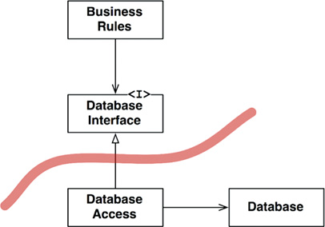
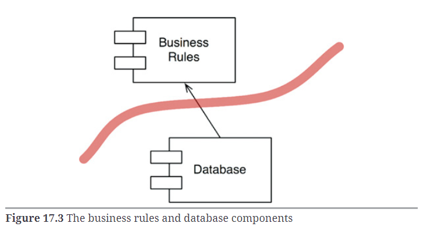
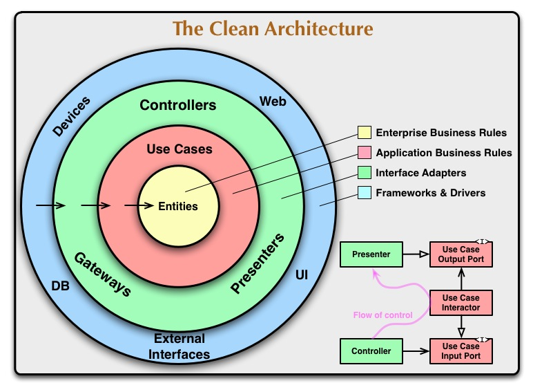

# Module 10 - Clean Architecture

## Conceitos Básicos

### Origem da Clean Architecture

* Termo criado por Robert C. Martin (Uncle Bob) em 2012
* Tornou-se um livro 
* Buzz word
* Proteção do domínio da aplicação
* Baixo acomplamento entre as camadas
* Orientada a casos de uso

> O livro é Clean Architecture: A Craftsman's Guide to Software Structure and Design (leitura recomendada)

#### Curiosidades sobre o livro:

* Ele fala especificamente sobre "Clean Architecture" em 7 paginas do livro
* Tudo que ele fala especificamente sobre Clean Architecture está literamente em um artigo em seu blog

#### Por que devo ler o livro?

* Reforçar conhecimento e remover gaps básicos que muitas vezes nem percebemos que temos
* Componentes
* Arquitetura
* Limites arquiteturais
* Percepção sobre regras de negócio

### Pontos Importantes sobre arquitetura

* Formato que o software terá
* Divisão de componentes
* Comunicação entre componentes
* Uma boa arquitetura facilitará o processo de desenvolvimento, deploy, operação e manuntenção

#### Pontos importantes sobre arquitetura

"The strategy behind that facilitation is to leave as many option open as possible, for as long as possible." ~ Uncle Bob

"A estratégia por trás dessa facilitação é deixar o maior número de opções abertas o maior tempo possível." ~ Uncle Bob

### Keep options open

#### Objetivos de uma boa arquitetura

O objetivo principal da arquitetura é dar suporte ao ciclo de vida do sistema. Uma boa arquitetura torna o sistema fácil de entender, fácil de desenvolver, fácil de manter e fácil de implantar. O objetivo final é minimizar o custo de vida útil do sistema e maximizar a produtividade do programador. ~ Uncle Bob

"Keep Options Open"

#### Regras vs Detalhes

* Regras de negócio trazem o real valor para o software
* Detalhes ajudam a suportar as regras
* Detalhes não devem impactar nas regras de negócio
* Frameworks, banco de dados, apis, não devem impactar nas regras de negócio

Lembra-se do DDD? Atacar a complexidade no coração do software.

### Uses cases

* Inteção
* Clareza de cada comportamento do software
* Detalhes não devem impactar nas regras de negócio
* Frameworks, banco de dados, apis, não devem impactar nas regras de negócio

#### Use Cases - SRP (Single Responsibility Principle)

* Temos a tendência de "reaproveitar" use cases por serem muito parecidos
* Ex.: Alterar vs Inserir. Ambos consultam se o registro existe, persistem dados. MAS, são Use Cases diferentes. Por que?
* SRP (Single Responsibility Principle) => mudam por razões diferentes

### O fluxo dos Use Cases

Use Cases contam uma história. 


> referência da imagem: https://medium.com/@unaware_harry/a-deep-dive-into-clean-architecture-and-solid-principles-dcdcec5db48a

### Limites arquiteturais

Tudo que não impacta diretamente nas regras de negócio deve estar em um limite arquitetural diferente. Ex.: não será o frontend, banco de dados que mudarão as regras de negócio da aplicação.





O Banco de Dados conhece as Regras de Negócios. As Regras de Negócios não conhecem o Banco de Dados.	



Algo que você deve questionar e até mesmo fazendo analogia é: "Será que o código que estou criando, se eu estiver, por exemplo, no primeiro andar de um prédio, eu estaria ao mesmo tempo no último andar do prédio". Se a resposta for sim, você está rompendo os limites arquiteturais.

### Input vs Output

* No final do dia, tudo se resume a um `Input` que retorna um `Output`
* Ex: Criar um pedido (dados do pedido = input) 
      Pedido criado (dados de retorno do pedido = output)
* Simplifique que seu raciocínio ao criar um software sempre pensando em `Input` e `Output`


### Entendendo DTOs

* Trafegar os dados entre os limites arquiteturais
* Objeto anêmico, sem comportamento
* Contém dados (Input ou Output)
* Não possui regras de negócio
* Não possui comportamento
* Não faz nada!

Ex.:

* API -> CONTROLLER -> USE CASE -> ENTITY
* Controller cria um DTO com os dados recebidos e envia para o Use Case
* Use Case executa seu fluxo, pega o resultado, cria um DTO para output e retorna para o Controller.

### Presenters

* Objetos de transformação
* Adequa o DTO de output no formato correto para entregar o resultado
* Lembrando: um sistema por ter diversos formatos de entrega. Ex.: XML, JSON, Protobuf, GraphQL, CLI, etc.

Vejamos um exemplo:

```javascript
input = new CategoryInputDTO("name");
output = CreateCategoryUseCase(input);
jsonResult = CategoryPresenter(output).toJson();
xmlResult = CategoryPresenter(output).toXml();
```

### Entities vs DTOs

* Entities da Clean Architecture são diferentes das Entities do DDD
* Clean Architecture define entity como camada de regras de negócio
* Elas se aplicam em qualquer situação
* Não há definição explicita de como criar as entities
* Normalmente utilizamos táticas do DDD
* Entities = Agregados + Domain Services

## Iniciando com Use Cases

### Relembrando o projeto

Link do repositório: **[fc-studies-clean-architecture](https://github.com/glaucia86/fc-studies-clean-architecture)**

### Criando nosso primeiro DTO - OK

Code Developed: **[commit](https://github.com/glaucia86/fc-studies-clean-architecture/commit/aff6b6fd57cc7f42ebb5b2230e14d8407b6bbb9d)**

### Testando criação para primeiro use case

Code Developed: **[commit](https://github.com/glaucia86/fc-studies-clean-architecture/commit/8d0785b530dabe3921ac5dac2e5b7bc27fdc334d)**

### Criando primeiro teste de unidade

Code Developed: **[commit](https://github.com/glaucia86/fc-studies-clean-architecture/commit/0b52e559e1eeac101b49b99bafc423981b5a36ac)**

### Retornando erro em teste de unidade

Code Developed: **[commit](https://github.com/glaucia86/fc-studies-clean-architecture/commit/96a0d2809b5ff4edc6637411378823d516d2c419)**

### Preparando teste de criação de Customer

Code Developed: **[commit](https://github.com/glaucia86/fc-studies-clean-architecture/commit/5e7f8840de4f917c32cd1eba95db6ef1356bbbab)**

### Criando UseCase para criar customer

Code Developed: **[commit](https://github.com/glaucia86/fc-studies-clean-architecture/commit/51a6477181a49ba9cf48164cc078aa0e8945f9fb)**

### Implementando testes de criar customer quanto temos dados inválidos

Code Developed: **[commit](https://github.com/glaucia86/fc-studies-clean-architecture/commit/a59ec344ff1e155ec04750849051ee9af23852e8)**

### Criando UseCase para alterar customer

Code Developed: **[commit](https://github.com/glaucia86/fc-studies-clean-architecture/commit/aee8970013314c1eb800a1c242ec5970216bb629)**

### Desenvolvendo UseCase para alterar Customer

Code Developed: **[commit](https://github.com/glaucia86/fc-studies-clean-architecture/commit/a0f522acd790b9e5430a39e5a227a4749e7d8562)**

### Testando usecase para listagem de Customer

Code Developed: **[commit](https://github.com/glaucia86/fc-studies-clean-architecture/commit/fde7dc4144720c23ed7b5811ee2e2c26500067b4)**

### Implementando listagem de Customer

Code Developed: **[commit](https://github.com/glaucia86/fc-studies-clean-architecture/commit/d87faabbd050d1eff400d8921cb128adc062f8ca)**

### Desafio de usecases

> Commits on Mar 25, 2024

## Camada de API

### Configurando Express

Code Developed: **[commit](https://github.com/glaucia86/fc-studies-clean-architecture/commit/889e72d4e71b577dd95512929affb88bcb71910e)**

### Criando primeiro teste E2E

Code Developed: **[commit](https://github.com/glaucia86/fc-studies-clean-architecture/commit/c1c57a89da88f05ee3d0f3086dd426f82a062dd4)**

### Criando primeiro endpoint

Code Developed: **[commit](https://github.com/glaucia86/fc-studies-clean-architecture/commit/a69ef81cd89493f97480e46b2164d302619b4376)**

### Fazendo nosso teste retornar 500

Code Developed: **[commit](https://github.com/glaucia86/fc-studies-clean-architecture/commit/2ff3910fe482f1e4a42a25d4bd8dd35784700b8c)**

### Testando listagem de Customers

Code Developed: **[commit](https://github.com/glaucia86/fc-studies-clean-architecture/commit/96788b87e8a7b0accb2a012a8ab5dfe0b6ba27de)**

### Implementando endpoint de listagem

Code Developed: **[commit](https://github.com/glaucia86/fc-studies-clean-architecture/commit/834a01d2d308b84f7dbfbb107e0e646c1984ddd9)**

### Endpoint para Products

Code Developed: **[commit](https://github.com/glaucia86/fc-studies-clean-architecture/commit/19091bd20c829000ec36b3cb22740f6582772a7d)**
Code Developed: **[commit](https://github.com/glaucia86/fc-studies-clean-architecture/commit/491b25af7d9874cc237a5e99c656443d41bd54cf)**

## Notification Pattern

### Implementando Notification Pattern

Code Developed: **[commit](https://github.com/glaucia86/fc-studies-clean-architecture/commit/a9d7484d0a93f6dade9b310c297ad1e0d79db991)**

### Adicionando Notication em Customer

Code Developed: **[commit](https://github.com/glaucia86/fc-studies-clean-architecture/commit/edddd0b36acfa7db61f5bbcbb628d6a9d5a247fb)**

### Criando NotificationError

Code Developed: **[commit](https://github.com/glaucia86/fc-studies-clean-architecture/commit/f67b78a7fb0d7495580727a0ff41b32357a2082a)**

### Corrigindo e executando todos os tests

Code Developed: **[commit](https://github.com/glaucia86/fc-studies-clean-architecture/commit/39bce4f43fac524b69f4c6c4c4f41fb73e017450)**

### Notification Pattern para Products

Code Developed: **[commit]()**
