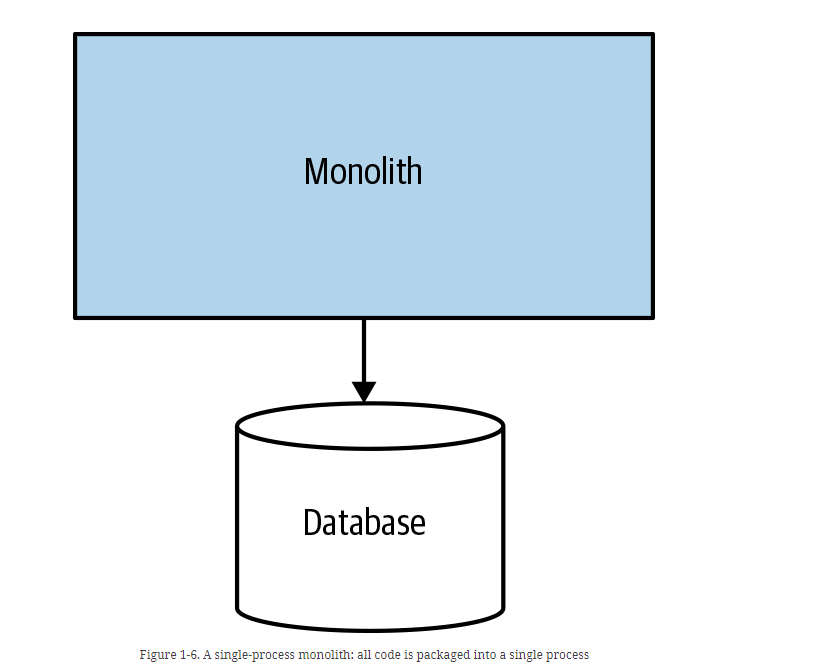
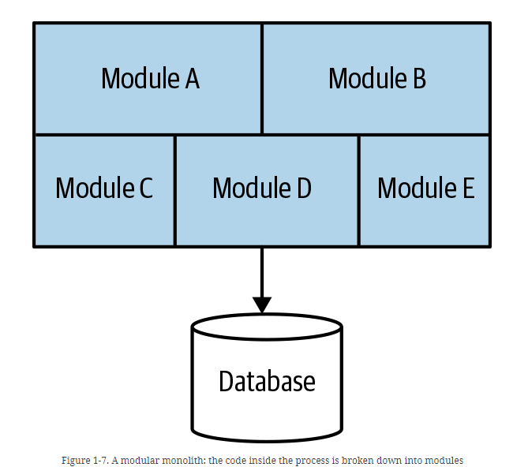
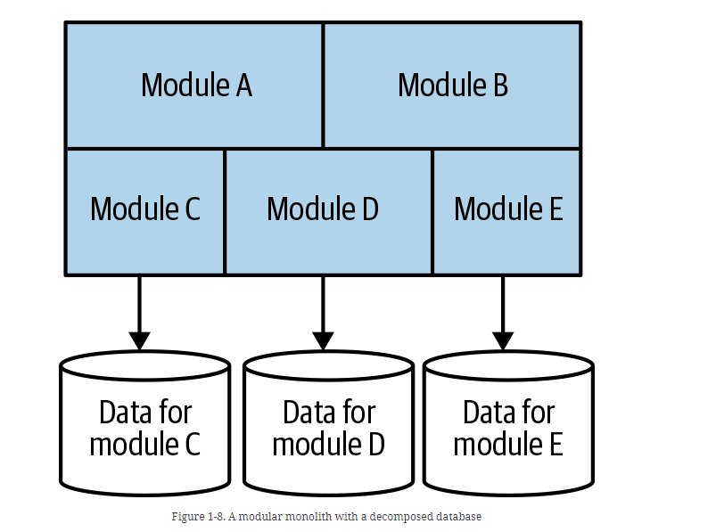
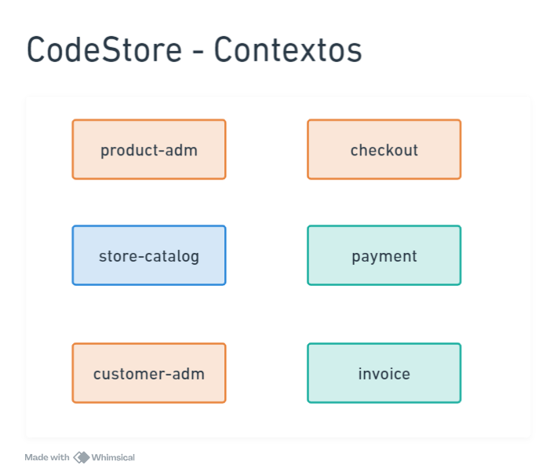
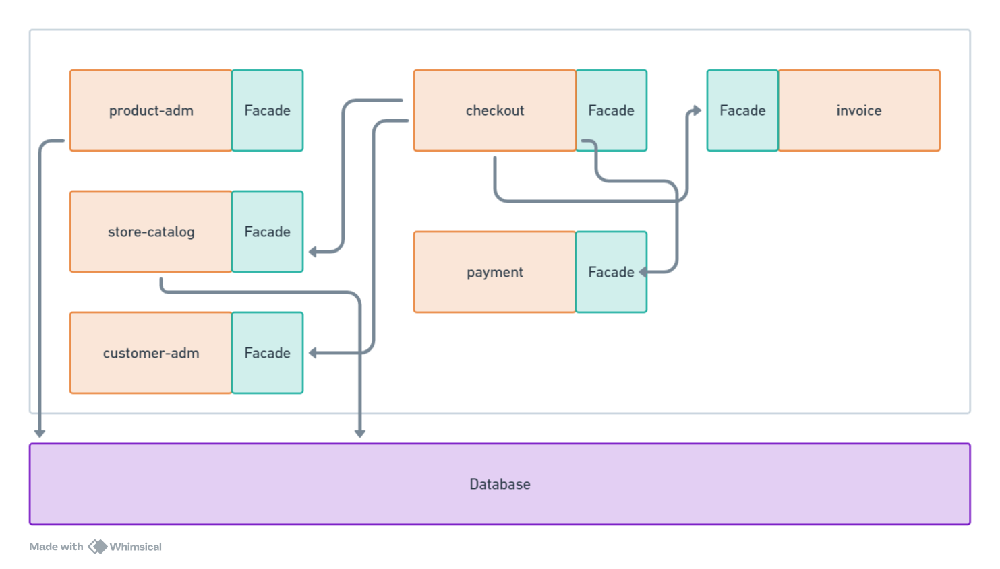
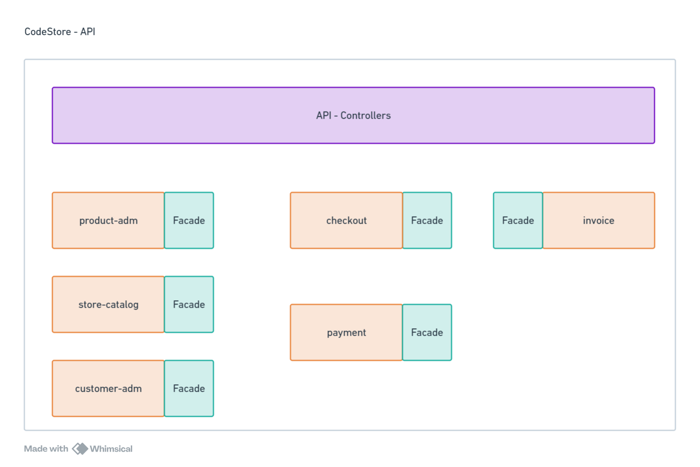

# Module 11 - Sistemas Monolíticos

## Conceitos Básicos

### Introdução

### As polêmicas por trás dos monolitos

#### O que é uma aplicação monolitica?
  - Aplicações "tradicionais"
  - "Tudo dentro de um único projeto"
  - Unidade de deployment

#### Polêmica por trás das aplicações monolíticas

- Aplicações da década passada
- Ultrapaassadas
- Não escalam
- Impedem o crescimento do negócio
- Alto acoplamento

Grande parte desses argumentos são FALSOS!

### Monolito em primeiro

#### Quando utilizar monolitos pode ser uma boa

- Novos projetos onde o modelo de negócio não está claro
- Instabilidade no core do negócio
- Evitar complexidade no processo de deploy
- Evitar complexidade na operação

> Artigo do Martin Fowler: Monolith First - https://martinfowler.com/bliki/MonolithFirst.html. Nesse artigo, Martin Fowler fala sobre a importância de começar com um monolito e depois evoluir para microserviços.
> "you shouldn't start a new project with microservices, even if you're sure your application will be big enough to make it worthwhile..." ou traduzindo: "você não deve começar um novo projeto com microserviços, mesmo que você tenha certeza de que sua aplicação será grande o suficiente para valer a pena..."

### Tipos de monolitos

- **Single process**: Todo o código é executado em um único processo
- **Monolitos Distribuídos**: Código é executado em diferentes processos
- **Black Box**: Código é executado em um único processo, mas com diferentes partes

> Newman, Sam. Monolith to Microservices (p. 21) O'Reilly Media. Edição do Kindle.

#### Single process

- Alto acoplamento
- Modular
- Modular com bancos de dados segregados

### Sistemas monoliticos acoplados

Vamos pensar em longo prazo com 'User'

- User
  - Dados pessoais
  - Endereços
  - Cartões de crédito
  - Tickets de suporte
  - Compras
  - Carrinho abandonado
  - Devoluções
  - Financiamento
  - Indicações
  - Reclamações
  - Email mkt
  - Campanhas
  - Favoritos
  - Lista de casamento
  - Histórico de login
  - Lista de preferência de emails
  - Avaliação de produtos
  - CRM
  - Propostas
  - Lances / Leilão
  - Cartão de Pontos

#### Principais problemas com essa abordagem

- Não existe contexto
- Entidades que relacionam
- Não há divisão. Tudo faz parte de tudo. Tudo grudado em tudo.
- Efeitos colaterais indesejados

Precisamos evitar isso!

### Sistemas monolíticos modulares

- DDD é um ponto de partida: pois com DDD tudo é contexto

Ex.:
- Catálogo
  - [user]

- Carrinho
  - [user]

- Checkout
  - [user]

- Pagamentos
  - [cliente]

- Suporte ao cliente
  - [cliente]

- Marketing
  - [lead]

- Programa de Pontos
  - [beneficiário]

- Lista de casamento
  - [convidado]

"Cada contexto pode virar um módulo no seu sistema monolítico. E cada módulo se conecta a uma base de dados."

Assim sendo os sistemas monolíticos modulares são:

- Módulos quebrados em 'bounded contexts'
- Conversam através de contratos e facades
- Entidades podem ser 'duplicadas' tendo apenas os atributos necessários
- Equipes especializadas por módulos
- Alta coesão: o que muda junto, permanece junto1

### Segregação de banco de dados

Aqui é a representação de um sistema monolítico modular com bancos de dados segregados.

Cada módulo pode ter seu próprio banco de dados. Isso é uma forma de garantir que cada módulo tenha sua própria responsabilidade e não se misture com os outros módulos.

Por que isso faz sentido?

Uma das coisas que causa acoplamento é o banco de dados. Se você tem um banco de dados compartilhado, você tem um acoplamento entre os módulos. Se você tem um banco de dados para cada módulo, você tem uma forma de garantir que cada módulo tenha sua própria responsabilidade e não se misture com os outros módulos.

### E os Microsserviços?

> "Se é para segregar tanto, não é melhor já trabalhar com microsserviços?"

Talvez você esteja se perguntando isso. E a resposta é: 

- Um único deploy
- Única operação
- Observabilidade simplificada
- Sistemas se comunicando internamente
- Única linguagem. Menos governança

### Shared Kernel

Shared Kernel é um núcleo compartilhado. É um conjunto de classes, interfaces, funções, etc. que são compartilhadas entre dois ou mais contextos delimitados.

## Estrutura do Projeto

### ContextMap

### Comunicação entre módulos

Você evitará acomplamento entre módulos através de contratos e facades.

### Comunicação interna vs externa

A comunicação interna com a externa acontecerá por meio de APIs, numa camada de Controllers.

## Iniciando projeto exemplo

### Criando pacote shared

**[Code Developed](https://github.com/glaucia86/fc-studies-monolith-ts/commit/0a54f3b0639da16cdb85c42d4632c42bd3c64dba)**

### Criando entidade Product

**[Code Developed](https://github.com/glaucia86/fc-studies-monolith-ts/commit/95991aba88a5af92d1da3c9892d07721811c76fe)**

### Criando teste para nosso usecase

**[Code Developed](https://github.com/glaucia86/fc-studies-monolith-ts/commit/c8f729621bd5aaf6825dab65bc090a2ae7631b3a)**

### Desenvolvendo caso de uso

**[Code Developed](https://github.com/glaucia86/fc-studies-monolith-ts/commit/89bd613602df0349b9fa7c43941d56534a0ddcb5)**

### Criando Teste do `ProductRepository`

**[Code Developed](https://github.com/glaucia86/fc-studies-monolith-ts/commit/d0e07cc093007d30dd69c302785cca85b401041c)**

### Implementando `Create Product`

**[Code Developed](https://github.com/glaucia86/fc-studies-monolith-ts/commit/bced91ce0104a9604c12c316d454ab4bdabd50a2)**

### Implementando find a product

**[Code Developed](https://github.com/glaucia86/fc-studies-monolith-ts/commit/c8bc68d529ee4fc4c797952fe3ab355f5b03517b)**

**[Code Developed](https://github.com/glaucia86/fc-studies-monolith-ts/commit/cfd52cc9e0cdf35c1761d3ef9a2c9436714340cb)**

**[Code Developed](https://github.com/glaucia86/fc-studies-monolith-ts/commit/35ba53a9bb5e873b90ecffddb48e792628daaf32)**

### Criando interface da nossa Facade

**[Code Developed](https://github.com/glaucia86/fc-studies-monolith-ts/commit/df96761f3358f33794dca538a78199866da0764a)**

### Implementando Facade

**[Code Developed](https://github.com/glaucia86/fc-studies-monolith-ts/commit/f9f45e1e3c525784be0516acf401f126a17a017a)**

### Testando nossa Facade

**[Code Developed](https://github.com/glaucia86/fc-studies-monolith-ts/commit/5e014b4d1f3bf36dac77af37fd4e4ea3e984f5e3)**

**[Code Developed](https://github.com/glaucia86/fc-studies-monolith-ts/commit/9aeb7b089f76e6cf979011e29bff67cd06665eac)**

### Implementando Factory para nossa Facade

**[Code Developed](https://github.com/glaucia86/fc-studies-monolith-ts/commit/ddd20d3beeb655390988331dd2bdb78bff592946)**

### Extra - Implementando `check-stock` use case

**[Code Developed](https://github.com/glaucia86/fc-studies-monolith-ts/commit/ea9c0b1512ee367c09661fe1e1df67d13bad6042)**

## Store Catalog

### Criando teste para checar estoque

**[Code Developed](https://github.com/glaucia86/fc-studies-monolith-ts/commit/ea9c0b1512ee367c09661fe1e1df67d13bad6042)**

### Implementando `CheckStockUseCase`

**[Code Developed](https://github.com/glaucia86/fc-studies-monolith-ts/commit/ea9c0b1512ee367c09661fe1e1df67d13bad6042)**

### Testando facade para verificação de stock

**[Code Developed](https://github.com/glaucia86/fc-studies-monolith-ts/commit/ea9c0b1512ee367c09661fe1e1df67d13bad6042)**

### Criando entidade Product

**[Code Developed](https://github.com/glaucia86/fc-studies-monolith-ts/commit/deb3a198dcc0fbea371c51628aecd285f5eea191)**

### Implementando teste do `FindAllProducts UseCase`

**[Code Developed](https://github.com/glaucia86/fc-studies-monolith-ts/commit/260dac5dc1794f7b34de8197773f468159f92e53)**

### Implementando `FindAllProducts UseCase`

**[Code Developed](https://github.com/glaucia86/fc-studies-monolith-ts/commit/a14f455b5dec69b8f63165f2ab036bc96f971622)**

### Criando Model de Product

**[Code Developed](https://github.com/glaucia86/fc-studies-monolith-ts/commit/2ac768cf1c67b95a4c1c3272428183f76f316b2c)**

### Criando testes para `ProductRepository`

**[Code Developed](https://github.com/glaucia86/fc-studies-monolith-ts/commit/e18d5e0a0a3ee1eae78c8c6971f39d44be5437cd)**

### Implementando `FindAll` no `ProductRepository`

**[Code Developed](https://github.com/glaucia86/fc-studies-monolith-ts/commit/5683f9950926adf95e18890696b6311e2a5144a4)**

### Testando UseCase `FindProduct`

**[Code Developed](https://github.com/glaucia86/fc-studies-monolith-ts/commit/a7af71b6b68421a9450de6af522828ad164ea851)**

### Finalizando `FindProductUseCase`

**[Code Developed](https://github.com/glaucia86/fc-studies-monolith-ts/commit/34e18b25591a1f6ac9245c346478fba7b9fc6ad0)**

### Finalizando repositório

**[Code Developed](https://github.com/glaucia86/fc-studies-monolith-ts/commit/db6b144560a0ee860748ee6904f8425cc724b866)**

### Criando Interface da `StoreCatalogFacade`

**[Code Developed](https://github.com/glaucia86/fc-studies-monolith-ts/commit/2d52841f731619d7a5a6d416eedab87857ed5f0b)**

### Criando teste para Facade StoreCatalog

**[Code Developed](https://github.com/glaucia86/fc-studies-monolith-ts/commit/8ae108d2c1bdec9ee6e9bccebae5e84630fb5e24)**

### Finalizando StoreCatalogFacade

**[Code Developed](https://github.com/glaucia86/fc-studies-monolith-ts/commit/c68c191c2f180b5d0aced799a4219a6a41474b3c)**

## Módulo ClientAdm

### Iniciando módulo `Client-Adm`

**[Code Developed](https://github.com/glaucia86/fc-studies-monolith-ts/commit/d480cfe94379b4e5c85b242c06e512889bc7b19f)**

### Implementando caso de uso `AddClient`

**[Code Developed](https://github.com/glaucia86/fc-studies-monolith-ts/commit/bddebab0a3543e217effd45e3b85d9676bab352c)**

### Implementando `FindClientUseCase`

**[Code Developed](https://github.com/glaucia86/fc-studies-monolith-ts/commit/12ffce91aa67f01f0351d56366998e44ca53fe59)**

### Implementando `ClientModel`

**[Code Developed](https://github.com/glaucia86/fc-studies-monolith-ts/commit/a20ac63c773b72e4e51579ddfd5f03f98509c3cf)**

### Implementando método `find` no `ClientRepository`

**[Code Developed](https://github.com/glaucia86/fc-studies-monolith-ts/commits/main/)**

### Implementando `Add` no `ClientRepository`

**[Code Developed](https://github.com/glaucia86/fc-studies-monolith-ts/commit/9d5abd45a05dd3cf5cedbc73dad1845c6be1bf58)**

### Implementando interface da facade

**[Code Developed](https://github.com/glaucia86/fc-studies-monolith-ts/commit/2097b84ce387643cba1e4fc784ca94928e4cf0c5)**

### Implementando Add da Facade

**[Code Developed](https://github.com/glaucia86/fc-studies-monolith-ts/commit/6ae20f64e51058201a3c9e8457bed07044fb3536)**

### Finalizando Facade e Factory

**[Code Developed](https://github.com/glaucia86/fc-studies-monolith-ts/commit/c5c49b25e00fab128a8cdec3b1f8d3dfcf5d5692)**

## Pagamento

### Iniciando com Payment

**[Code Developed](https://github.com/glaucia86/fc-studies-monolith-ts/commit/21b7422e0a03ba7386f12581ed54dac7c46a04b7)**

### Finalizando criação da entidade

**[Code Developed](https://github.com/glaucia86/fc-studies-monolith-ts/commit/f0450cfca599de85453b753cc4ea5787a0f37743)**

### Desenvolvendo UseCase de ProcessPayment

**[Code Developed](https://github.com/glaucia86/fc-studies-monolith-ts/commit/d1740f795cd9d478dd394bb6ed5a4e8fc4bfacb8)**

### Finalizando testes do caso de uso

**[Code Developed](https://github.com/glaucia86/fc-studies-monolith-ts/commit/2e7e4a6ded05bdf5341c15b58f5d2928af0f31a7)**

### Criando repositório de `Transaction`

**[Code Developed](https://github.com/glaucia86/fc-studies-monolith-ts/commit/fc713488c572c8f886fa557e4767e90fd2db8516)**

### Implementando `PaymentFacade`

**[Code Developed](https://github.com/glaucia86/fc-studies-monolith-ts/commit/f3258aef846044988388fc7687b1776085a8aba1)**

### Finalizando Factory

**[Code Developed](https://github.com/glaucia86/fc-studies-monolith-ts/commit/914f02033847a22478404d82b5718b5416dd18ac)**

## Invoice

### Criação de módulo de Invoice

**[Code Developed](https://github.com/glaucia86/fc-studies-monolith-ts/commit/e10dee649da35b145eb6a9113ee7ed2c6ea3384d)**
**[Code Developed](https://github.com/glaucia86/fc-studies-monolith-ts/commit/989128bbf6311d9226b2d02fa9b5a97b0efe1ff0)**
**[Code Developed](https://github.com/glaucia86/fc-studies-monolith-ts/commit/3ebad1bf0cf1520394f2688a9235ac8b318361ea)**
**[Code Developed](https://github.com/glaucia86/fc-studies-monolith-ts/commit/a815143c31f309dbcaa5a17e09627ea9599f1267)**

## Checkout

### Criando entidade client

**[Code Developed](https://github.com/glaucia86/fc-studies-monolith-ts/commit/1693bf231764df8528bd351bb15b6a013395653f)**

### Implementando product e order

**[Code Developed](https://github.com/glaucia86/fc-studies-monolith-ts/commit/16a531b93126fc84be13e370508eee3c59c09a12)**

### Preparando UseCase

**[Code Developed](https://github.com/glaucia86/fc-studies-monolith-ts/commit/8dea7ba6649f8f7a33ef710285ee95b72d99e71e)**